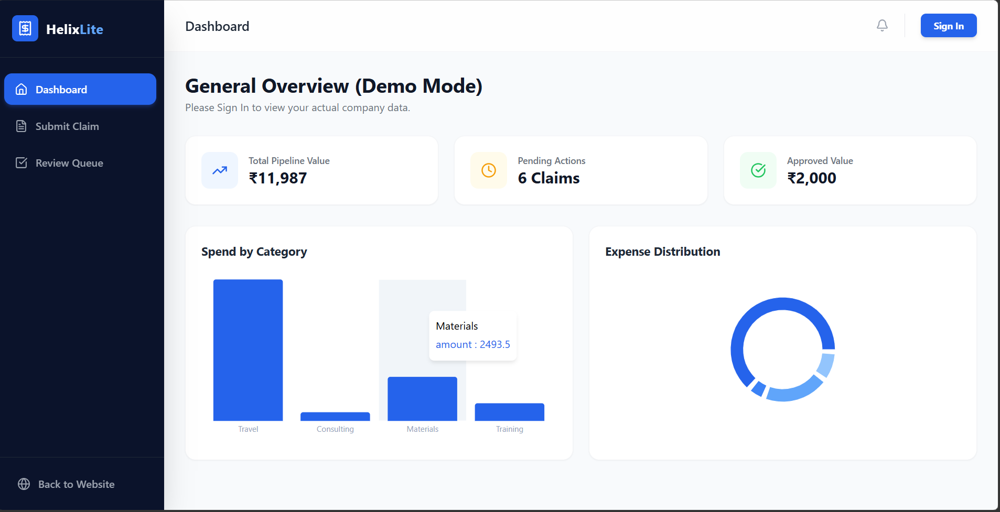
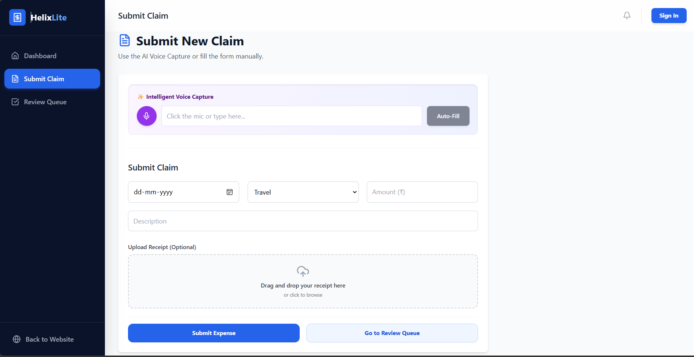
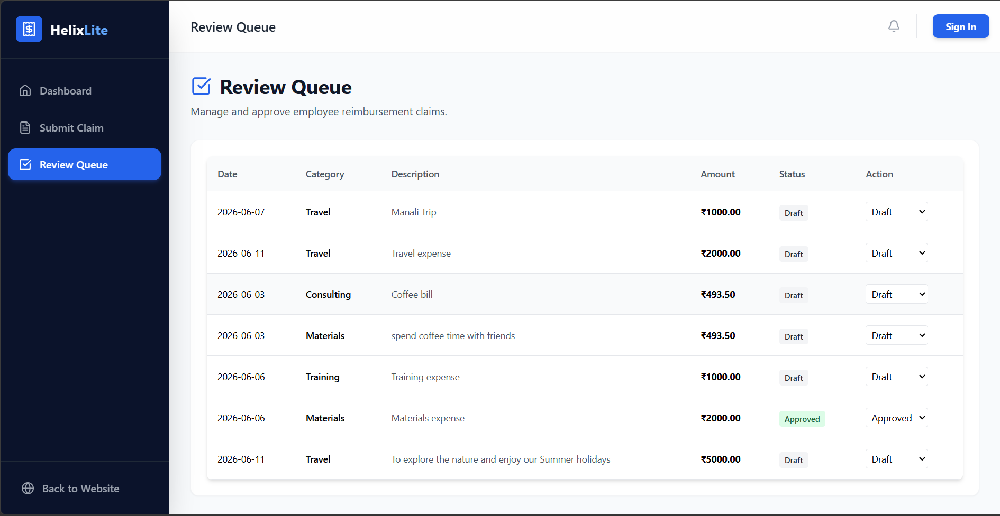

# 💸 HelixLite – AI-Powered Expense Management System

<div align="center">

### Smart • Fast • Secure Expense Tracking

An intelligent expense management platform that simplifies claim submission, automates expense extraction using AI, and streamlines approval workflows for organizations.


</div>

---

## 🌐 Live Demo

🔗 Live website: **https://helix-lite-expense-system.vercel.app/**

🎥 Project Walkthrough:  **https://drive.google.com/file/d/1ND47sFr1dbDjseOObFOSl9_ujU8BWdXN/view?usp=drive_link**
---

# 📖 Project Overview

HelixLite is a modern expense management system designed to help employees submit reimbursement claims and enable managers to review and approve them efficiently.

The platform combines a clean enterprise-grade user experience with Artificial Intelligence to reduce manual data entry and improve productivity.

---

# ✨ Key Features

## 📋 Expense Management

* Create and manage expense claims
* Track claim status in real time
* View submitted and approved expenses
* Organized dashboard experience

## 📄 Receipt Upload

* Drag & Drop file upload
* Image preview before submission
* Receipt attachment support

## 🔄 Approval Workflow

* Draft
* Submitted
* Approved
* Rejected

Complete claim lifecycle management.

## 🎙️ AI Voice Expense Entry

Users can speak naturally:

> "I spent ₹450 on lunch with a client yesterday."

Google Gemini automatically extracts:

* Amount
* Category
* Description
* Expense Details

and fills the form instantly.

## 🔐 Authentication System

* Secure login interface
* Protected dashboard access
* Context API state management

## 📱 Responsive Design

* Desktop
* Tablet
* Mobile

Fully responsive user experience.

---

# 🖼️ Screenshots

## Landing Page


## Dashboard



## Expense Submission



## Review Queue



---

# 🏗️ System Architecture

```text
User
 │
 ▼
React Frontend
 │
 ├── Authentication
 ├── Dashboard
 ├── Expense Form
 └── Review Queue
 │
 ▼
Flask Backend API
 │
 ├── Expense CRUD
 ├── Claim Processing
 ├── AI Parsing Endpoint
 └── Database Operations
 │
 ▼
SQLite Database
 │
 ▼
Google Gemini API
```

---

# ⚙️ Technology Stack

| Category         | Technologies                 |
| ---------------- | ---------------------------- |
| Frontend         | React.js, Vite, Tailwind CSS |
| Backend          | Flask, Flask-CORS            |
| Database         | SQLite, SQLAlchemy           |
| AI Integration   | Google Gemini 2.5 Flash      |
| State Management | React Context API            |
| Hosting          | Vercel, Render               |
| Version Control  | Git & GitHub                 |

---

# 📂 Project Structure

```text
helix-lite-expense-system/
│
├── backend/
│   ├── instance/               # SQLite Database
│   ├── app.py                  # Flask API & Gemini Routing
│   ├── models.py               # SQLAlchemy Database Schema
│   ├── requirements.txt        # Python Dependencies
│   └── .env
│
└── frontend/
    ├── public/                 # Static assets & Favicon
    ├── src/
    │   ├── assets/             # Backgrounds & branding
    │   ├── components/         # AuthModal, ExpenseForm, ExpenseList
    │   ├── context/            # AuthContext (Global State)
    │   ├── layouts/            # MainLayout (Sidebar routing)
    │   ├── pages/              # Dashboard, LandingPage, ReviewQueue, SubmitClaim
    │   └── App.jsx
    │
    ├── package.json
    ├── vite.config.js
    └── .env
```

---

# 🚀 Getting Started

## 1️⃣ Clone Repository

```bash
git clone https://github.com/MohitPal2005/helix-lite-expense-system.git

cd helix-lite-expense-system
```

---

## 2️⃣ Backend Setup

```bash
cd backend

python -m venv venv
```

Activate environment:

### Windows

```bash
venv\Scripts\activate
```

### Mac/Linux

```bash
source venv/bin/activate
```

Install dependencies:

```bash
pip install -r requirements.txt
```

Create `.env`

```env
GEMINI_API_KEY=YOUR_API_KEY
```

Run Backend:

```bash
python app.py
```

---

## 3️⃣ Frontend Setup

```bash
cd frontend

npm install
```

Create `.env`

```env
VITE_API_URL=http://127.0.0.1:5000
```

Run Frontend:

```bash
npm run dev
```

---

# 💡 Engineering Decisions

### Browser-Based Authentication

To ensure evaluators can instantly test the application without external setup, a lightweight local authentication layer was implemented.

Future upgrades:

* Firebase Authentication
* Google OAuth
* JWT-based backend authentication

### Receipt Storage

Current implementation uses browser-generated object URLs for previews.

Production roadmap:

* AWS S3
* Cloudinary
* Firebase Storage

---

# 🎯 Future Enhancements

* Email Notifications
* Role-Based Access Control
* PDF Report Generation
* Expense Analytics Dashboard
* OCR Receipt Scanning
* Multi-Level Approval Flow
* Cloud Storage Integration

---

# 👨‍💻 Developer

## Mohit Pal

B.Tech Computer Science & Engineering

VIT Bhopal University (2024–2028)

### Skills

* Full Stack Development
* Artificial Intelligence
* Machine Learning
* React Development
* Python Development

### Connect

GitHub: https://github.com/MohitPal2005

LinkedIn: https://www.linkedin.com/in/mohit-pal-117430338/

---

# ⭐ Support

If you found this project useful, consider giving it a ⭐ on GitHub.

HelixLite © 2026
